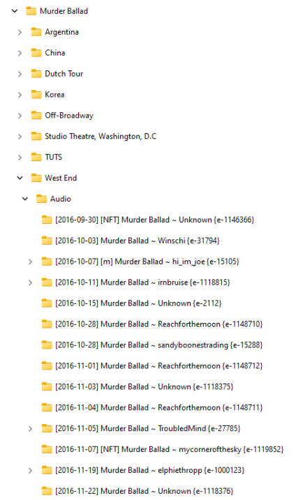

# Bootleg Organiser

Bootleg Organiser is a Python script designed to help you organise your local files, update Encora, and ensure that your local data is kept up to date with Encora.

A useful thing I have found is after trading for a new recording, I can throw the folder into the directory specified in the `.env` file, and just name it `{e-######}` for the Encora ID, run the script and it sorts everything for me, including the format on Encora. You don't even need to 'Collect' it on the site first.

## Features

- File Organisation: Bootleg Organiser scans your specified directories and organises your files based on customisable rules.
- Auto-Collecting: Will automatically collect a recording on Encora if an ID is found in your folder.
- Encora Update: Bootleg Organiser automatically updates your Encora formats with the latest files from your local storage.
- Data Synchronization: Bootleg Organiser ensures that your local data is always synchronized with Encora, keeping everything up to date.
- Subtitle Downloads: Optional, Bootleg Organiser will _remove any local subtitles_ and replace them with ones from Encora.
- .encora-{id} files: These will be generated for use with the upcoming Encora PlexAgent
- Cast files: Optional, These will replace any existing Cast.txt files with ones generated from Encora
- Generates `missing_ids.txt` which is IDs you have collected on Encora but _not_ in your local folders
- Generates `extra_ids.txt` which is IDs you have in your folders, but _not_ on Encora

> [!WARNING]  
> This will likely use a LOT of API requests on the first run, especially if updating a lot of formats.
> Subsequent runs should use less as your formats will already match.
>
> - Each run of the script will fetch your collection on Encora which will use n/500 requests (where n = the number of recordings you own)
>   - e.g. 1752 recordings / 500 = 3.5 so 4 requests will be made.
> - Updating formats will be 1 request PER format to be updated on Encora. It will not use an API request if the format on Encora is the same as you have locally, but will if you upgrade your files.
> - Downloading subtitles has been optimised to use 1 request to fetch all required subtitles.

The script is configured to handle API request limits and wait for it to expire if the limit is reached, though this is untested.

  
Example output folder structure:

This is with the following .env formats:  
 `SHOW_DIRECTORY_FORMAT="{show_name}/{tour}/{type}/"`

`SHOW_FOLDER_FORMAT="[{date}] {highlights} [{matinee}] [{nft}] {show_name} ~ {master} {{e-{encora_id}}}"`

## Installation

1. Clone the Bootleg Organiser repository to your local machine.
2. Configure the script by copying `.env.example` to `.env` and editing the `.env` file with your settings.
3. Run the script using `python full-organise.py`.

## Usage

> [!WARNING]  
> Any non-Encora recordings should have `{ne}` as part of the folder name to place them into a `!non-encora` folder so they will not be processed.
> Any Encora recordings should have `{e-#####}` as part of the folder name to match them to Encora recordings. E.g. `Murder Ballad West End {e-1118317}`

1. Specify the directories you want to organise in the `.env` file.
2. Customise the file organisation rules according to your preferences.
3. Run the script to start organising your files and updating Encora.

## Configuration

Bootleg Organiser uses a `.env` file for configuration. You can customise various settings, including:

- Directories to organise
- File organisation rules
- Encora API credentials

Please refer to the comments in the `.env.example` file for detailed instructions on how to configure each setting.

## Running the Scripts

- **Full Organise**: Run `python full-organise.py` to perform a complete organisation of your files, download subtitles, and update your formats. It will also update any Cast.txt you have with corrected data from Encora.
